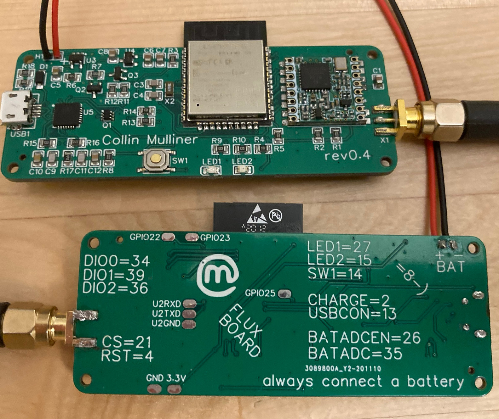

# Fluxboard

Fluxboard is a purpose designed board to run Fluxn0de.

Fluxboard specs:
- ESP32 WRoom with 16MB
- HopeRF RFM95W
- 2 LEDs (red + green)
- 32khz oscillator as external clock source
- button
- battery charging circuit
- battery charging detection (GPIO)
- battery measurement circuit (with low drain)
- USB (power) connected detection (GPIO)
- ESP32 Uart2 PINs exposed on backside
- GPIO 22,23 (I2C) exposed on backside 
- GPIO 25 exposed on backside
- GND + 3.3V exposed on backside

# Board

[Fluxboard v0.4 schematics](fluxboard_0.4.pdf)

Two fluxboards, the board's full PINout documented on the backside.

