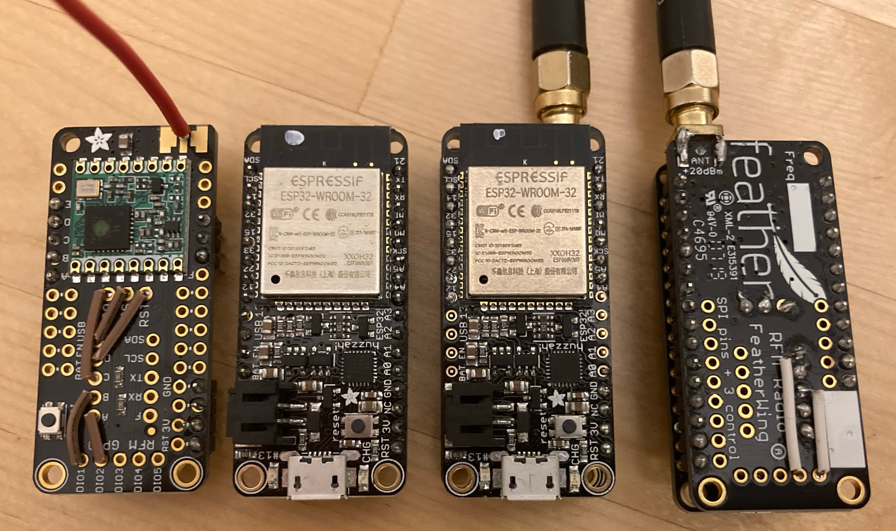

# Huzzah

The Huzzah board basically just combines two Adadfruit boards into one.

- ESP32 [Huzzah32](https://www.adafruit.com/product/3405) board
- LoRa [Adafruit LoRa Radio FeatherWing - RFM95W 900 MHz - RadioFruit](https://www.adafruit.com/product/3231) (this is the 900Mhz version)

Huzzah32 specs:
- 4MB flash
- 1 LED
- battery charging circuit
- battery charge measurement (drains battery)
- all GPIOs exposed

## LoRa Board wiring

The LoRa feather has to be wired up in the following way:
- RST to pin D
- CS to pin E
- IRQ/DIO0 to pin C
- DIO1 to pin B
- DIO2 to pin A

## Combining the Boards

Basically stack the Huzzah32 on top of the LoRa board so that the LoRa antenna is on the opposite side of the USB connector.
Also solder an antenna or antenna connector.

## Boards

Left to right: LoRa feather (with wiring), Huzzah32, Huzzah+LoRaFeather with antenna connector (top view, bottom view - with some of the wires solder on the bottom side).

